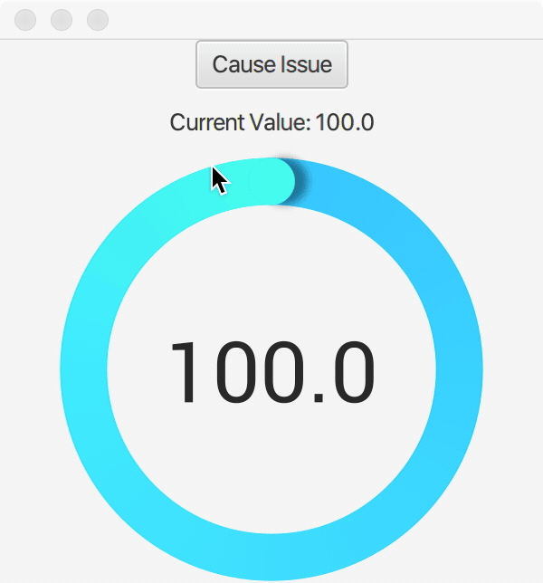

About
======

This repository contains an example of an issue encountered using Medusa Gauges. The result of the issue is that the displayed gauge value doesn't match the underlying value. This is demonstrated by quickly updating from `100` -> `50` -> `1`, the gauge displays `50` but the current value is 1. This seems to only occur when animation is enabled.

# Running

This application can be run via gradle with the following:  

`./gradlew run`

We're assuming you're using JDK 11+. If you need JDK8 then see `build.gradle` for what to change.

# Issue

Here is a gif capturing the issue:

